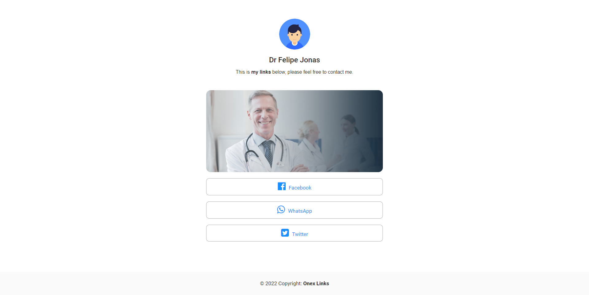

# Linktree-Mern-stack
Linktree is a MERN stack App with Redux toolkit that helps to share your social network links without the need to share them separately. It comes with a lot of features.

# Features:
##### - Software Architecture: MVC pattern
##### - Forget and reset password by sending email with the reset link. The generated link contains a token that is available for 10mn after that the link will expire.
##### - Admin dashboard, pagination, etc.
##### - User role
##### - Modern authentication system with JWT and cookie;
##### - Block client for any reason.
##### - Automatic logout after 1h.
##### - Modern authentication system with JWT and cookie;
##### - Toast notification;
##### - Pagination Front-End and Backend
##### - Hide or show Link / edit link, etc.

